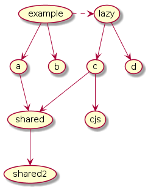
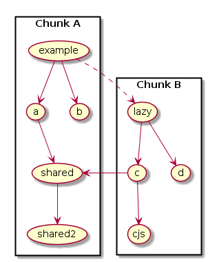
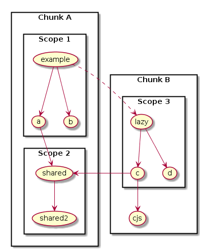

This example demonstrates Scope Hoisting in combination with Code Splitting.

This is the dependency graph for the example: (solid lines express sync imports, dashed lines async imports)



All modules except `cjs` are EcmaScript modules. `cjs` is a CommonJs module.

The interesting thing here is that putting all modules in single scope won't work, because of multiple reasons:

- Modules `lazy`, `c`, `d` and `cjs` need to be in a separate chunk
- Module `shared` is accessed by two chunks (different scopes)
- Module `cjs` is a CommonJs module



webpack therefore uses a approach called **"Partial Scope Hoisting"** or "Module concatenation", which chooses the largest possible subsets of ES modules which can be scope hoisted and combines them with the default webpack primitives.



While module concatenation identifiers in modules are renamed to avoid conflicts and internal imports are simplified. External imports and exports from the root module use the existing ESM constructs.

# example.js

```javascript
import { a, x, y } from "a";
import * as b from "b";

import("./lazy").then(function(lazy) {
	console.log(a, b.a(), x, y, lazy.c, lazy.d.a, lazy.x, lazy.y);
});
```

# lazy.js

```javascript
export * from "c";
import * as d from "d";
export { d };
```

# a.js

```javascript
// module a
export var a = "a";
export * from "shared";
```

# b.js

```javascript
// module b
export function a() {
	return "b";
};
```

# c.js

```javascript
// module c
import { c as e } from "cjs";

export var c = String.fromCharCode(e.charCodeAt(0) - 2);

export { x, y } from "shared";
```

# d.js

```javascript
// module d
export var a = "d";
```

# cjs.js

```javascript
// module cjs (commonjs)
exports.c = "e";
```

# shared.js

```javascript
// shared module
export var x = "x";
export * from "shared2";
```

# shared2.js

```javascript
// shared2 module
export var y = "y";
```

# webpack.config.js

```javascript
module.exports = {
	// mode: "development" || "production",
	optimization: {
		usedExports: true,
		concatenateModules: true,
		chunkIds: "deterministic" // To keep filename consistent between different modes (for example building only)
	}
};
```

# dist/output.js

```javascript
/******/ (() => { // webpackBootstrap
/******/ 	"use strict";
/******/ 	var __webpack_modules__ = ([
/* 0 */,
/* 1 */
/*!********************************************!*\
  !*** ./node_modules/shared.js + 1 modules ***!
  \********************************************/
/*! namespace exports */
/*! export x [provided] [used in main] [could be renamed] */
/*! export y [provided] [used in main] [could be renamed] -> ./node_modules/shared2.js .y */
/*! runtime requirements: __webpack_exports__, __webpack_require__.d, __webpack_require__.* */
/***/ ((__unused_webpack_module, __webpack_exports__, __webpack_require__) => {


// EXPORTS
__webpack_require__.d(__webpack_exports__, {
  "x": () => (/* binding */ x),
  "y": () => (/* reexport */ y)
});

;// CONCATENATED MODULE: ./node_modules/shared2.js
// shared2 module
var y = "y";

;// CONCATENATED MODULE: ./node_modules/shared.js
// shared module
var x = "x";


/***/ })
/******/ 	]);
```

<details><summary><code>/* webpack runtime code */</code></summary>

``` js
/************************************************************************/
/******/ 	// The module cache
/******/ 	var __webpack_module_cache__ = {};
/******/ 	
/******/ 	// The require function
/******/ 	function __webpack_require__(moduleId) {
/******/ 		// Check if module is in cache
/******/ 		var cachedModule = __webpack_module_cache__[moduleId];
/******/ 		if (cachedModule !== undefined) {
/******/ 			return cachedModule.exports;
/******/ 		}
/******/ 		// Create a new module (and put it into the cache)
/******/ 		var module = __webpack_module_cache__[moduleId] = {
/******/ 			// no module.id needed
/******/ 			// no module.loaded needed
/******/ 			exports: {}
/******/ 		};
/******/ 	
/******/ 		// Execute the module function
/******/ 		__webpack_modules__[moduleId](module, module.exports, __webpack_require__);
/******/ 	
/******/ 		// Return the exports of the module
/******/ 		return module.exports;
/******/ 	}
/******/ 	
/******/ 	// expose the modules object (__webpack_modules__)
/******/ 	__webpack_require__.m = __webpack_modules__;
/******/ 	
/************************************************************************/
/******/ 	/* webpack/runtime/define property getters */
/******/ 	(() => {
/******/ 		// define getter functions for harmony exports
/******/ 		__webpack_require__.d = (exports, definition) => {
/******/ 			for(var key in definition) {
/******/ 				if(__webpack_require__.o(definition, key) && !__webpack_require__.o(exports, key)) {
/******/ 					Object.defineProperty(exports, key, { enumerable: true, get: definition[key] });
/******/ 				}
/******/ 			}
/******/ 		};
/******/ 	})();
/******/ 	
/******/ 	/* webpack/runtime/ensure chunk */
/******/ 	(() => {
/******/ 		__webpack_require__.f = {};
/******/ 		// This file contains only the entry chunk.
/******/ 		// The chunk loading function for additional chunks
/******/ 		__webpack_require__.e = (chunkId) => {
/******/ 			return Promise.all(Object.keys(__webpack_require__.f).reduce((promises, key) => {
/******/ 				__webpack_require__.f[key](chunkId, promises);
/******/ 				return promises;
/******/ 			}, []));
/******/ 		};
/******/ 	})();
/******/ 	
/******/ 	/* webpack/runtime/get javascript chunk filename */
/******/ 	(() => {
/******/ 		// This function allow to reference async chunks
/******/ 		__webpack_require__.u = (chunkId) => {
/******/ 			// return url for filenames based on template
/******/ 			return "" + chunkId + ".output.js";
/******/ 		};
/******/ 	})();
/******/ 	
/******/ 	/* webpack/runtime/hasOwnProperty shorthand */
/******/ 	(() => {
/******/ 		__webpack_require__.o = (obj, prop) => (Object.prototype.hasOwnProperty.call(obj, prop))
/******/ 	})();
/******/ 	
/******/ 	/* webpack/runtime/load script */
/******/ 	(() => {
/******/ 		var inProgress = {};
/******/ 		// data-webpack is not used as build has no uniqueName
/******/ 		// loadScript function to load a script via script tag
/******/ 		__webpack_require__.l = (url, done, key, chunkId) => {
/******/ 			if(inProgress[url]) { inProgress[url].push(done); return; }
/******/ 			var script, needAttach;
/******/ 			if(key !== undefined) {
/******/ 				var scripts = document.getElementsByTagName("script");
/******/ 				for(var i = 0; i < scripts.length; i++) {
/******/ 					var s = scripts[i];
/******/ 					if(s.getAttribute("src") == url) { script = s; break; }
/******/ 				}
/******/ 			}
/******/ 			if(!script) {
/******/ 				needAttach = true;
/******/ 				script = document.createElement('script');
/******/ 		
/******/ 				script.charset = 'utf-8';
/******/ 				script.timeout = 120;
/******/ 				if (__webpack_require__.nc) {
/******/ 					script.setAttribute("nonce", __webpack_require__.nc);
/******/ 				}
/******/ 		
/******/ 				script.src = url;
/******/ 			}
/******/ 			inProgress[url] = [done];
/******/ 			var onScriptComplete = (prev, event) => {
/******/ 				// avoid mem leaks in IE.
/******/ 				script.onerror = script.onload = null;
/******/ 				clearTimeout(timeout);
/******/ 				var doneFns = inProgress[url];
/******/ 				delete inProgress[url];
/******/ 				script.parentNode && script.parentNode.removeChild(script);
/******/ 				doneFns && doneFns.forEach((fn) => (fn(event)));
/******/ 				if(prev) return prev(event);
/******/ 			}
/******/ 			;
/******/ 			var timeout = setTimeout(onScriptComplete.bind(null, undefined, { type: 'timeout', target: script }), 120000);
/******/ 			script.onerror = onScriptComplete.bind(null, script.onerror);
/******/ 			script.onload = onScriptComplete.bind(null, script.onload);
/******/ 			needAttach && document.head.appendChild(script);
/******/ 		};
/******/ 	})();
/******/ 	
/******/ 	/* webpack/runtime/make namespace object */
/******/ 	(() => {
/******/ 		// define __esModule on exports
/******/ 		__webpack_require__.r = (exports) => {
/******/ 			if(typeof Symbol !== 'undefined' && Symbol.toStringTag) {
/******/ 				Object.defineProperty(exports, Symbol.toStringTag, { value: 'Module' });
/******/ 			}
/******/ 			Object.defineProperty(exports, '__esModule', { value: true });
/******/ 		};
/******/ 	})();
/******/ 	
/******/ 	/* webpack/runtime/publicPath */
/******/ 	(() => {
/******/ 		__webpack_require__.p = "dist/";
/******/ 	})();
/******/ 	
/******/ 	/* webpack/runtime/jsonp chunk loading */
/******/ 	(() => {
/******/ 		// no baseURI
/******/ 		
/******/ 		// object to store loaded and loading chunks
/******/ 		// undefined = chunk not loaded, null = chunk preloaded/prefetched
/******/ 		// [resolve, reject, Promise] = chunk loading, 0 = chunk loaded
/******/ 		var installedChunks = {
/******/ 			179: 0
/******/ 		};
/******/ 		
/******/ 		__webpack_require__.f.j = (chunkId, promises) => {
/******/ 				// JSONP chunk loading for javascript
/******/ 				var installedChunkData = __webpack_require__.o(installedChunks, chunkId) ? installedChunks[chunkId] : undefined;
/******/ 				if(installedChunkData !== 0) { // 0 means "already installed".
/******/ 		
/******/ 					// a Promise means "currently loading".
/******/ 					if(installedChunkData) {
/******/ 						promises.push(installedChunkData[2]);
/******/ 					} else {
/******/ 						if(true) { // all chunks have JS
/******/ 							// setup Promise in chunk cache
/******/ 							var promise = new Promise((resolve, reject) => (installedChunkData = installedChunks[chunkId] = [resolve, reject]));
/******/ 							promises.push(installedChunkData[2] = promise);
/******/ 		
/******/ 							// start chunk loading
/******/ 							var url = __webpack_require__.p + __webpack_require__.u(chunkId);
/******/ 							// create error before stack unwound to get useful stacktrace later
/******/ 							var error = new Error();
/******/ 							var loadingEnded = (event) => {
/******/ 								if(__webpack_require__.o(installedChunks, chunkId)) {
/******/ 									installedChunkData = installedChunks[chunkId];
/******/ 									if(installedChunkData !== 0) installedChunks[chunkId] = undefined;
/******/ 									if(installedChunkData) {
/******/ 										var errorType = event && (event.type === 'load' ? 'missing' : event.type);
/******/ 										var realSrc = event && event.target && event.target.src;
/******/ 										error.message = 'Loading chunk ' + chunkId + ' failed.\n(' + errorType + ': ' + realSrc + ')';
/******/ 										error.name = 'ChunkLoadError';
/******/ 										error.type = errorType;
/******/ 										error.request = realSrc;
/******/ 										installedChunkData[1](error);
/******/ 									}
/******/ 								}
/******/ 							};
/******/ 							__webpack_require__.l(url, loadingEnded, "chunk-" + chunkId, chunkId);
/******/ 						} else installedChunks[chunkId] = 0;
/******/ 					}
/******/ 				}
/******/ 		};
/******/ 		
/******/ 		// no prefetching
/******/ 		
/******/ 		// no preloaded
/******/ 		
/******/ 		// no HMR
/******/ 		
/******/ 		// no HMR manifest
/******/ 		
/******/ 		// no on chunks loaded
/******/ 		
/******/ 		// install a JSONP callback for chunk loading
/******/ 		var webpackJsonpCallback = (parentChunkLoadingFunction, data) => {
/******/ 			var [chunkIds, moreModules, runtime] = data;
/******/ 			// add "moreModules" to the modules object,
/******/ 			// then flag all "chunkIds" as loaded and fire callback
/******/ 			var moduleId, chunkId, i = 0;
/******/ 			if(chunkIds.some((id) => (installedChunks[id] !== 0))) {
/******/ 				for(moduleId in moreModules) {
/******/ 					if(__webpack_require__.o(moreModules, moduleId)) {
/******/ 						__webpack_require__.m[moduleId] = moreModules[moduleId];
/******/ 					}
/******/ 				}
/******/ 				if(runtime) var result = runtime(__webpack_require__);
/******/ 			}
/******/ 			if(parentChunkLoadingFunction) parentChunkLoadingFunction(data);
/******/ 			for(;i < chunkIds.length; i++) {
/******/ 				chunkId = chunkIds[i];
/******/ 				if(__webpack_require__.o(installedChunks, chunkId) && installedChunks[chunkId]) {
/******/ 					installedChunks[chunkId][0]();
/******/ 				}
/******/ 				installedChunks[chunkIds[i]] = 0;
/******/ 			}
/******/ 		
/******/ 		}
/******/ 		
/******/ 		var chunkLoadingGlobal = self["webpackChunk"] = self["webpackChunk"] || [];
/******/ 		chunkLoadingGlobal.forEach(webpackJsonpCallback.bind(null, 0));
/******/ 		chunkLoadingGlobal.push = webpackJsonpCallback.bind(null, chunkLoadingGlobal.push.bind(chunkLoadingGlobal));
/******/ 	})();
/******/ 	
/************************************************************************/
```

</details>

``` js
var __webpack_exports__ = {};
// This entry need to be wrapped in an IIFE because it need to be isolated against other modules in the chunk.
(() => {
/*!********************************!*\
  !*** ./example.js + 2 modules ***!
  \********************************/
/*! namespace exports */
/*! runtime requirements: __webpack_require__, __webpack_require__.e, __webpack_require__.* */
/*! ModuleConcatenation bailout: Cannot concat with ./node_modules/shared.js: Module ./node_modules/shared.js is referenced from different chunks by these modules: ./node_modules/c.js */

// EXTERNAL MODULE: ./node_modules/shared.js + 1 modules
var shared = __webpack_require__(1);
;// CONCATENATED MODULE: ./node_modules/a.js
// module a
var a = "a";


;// CONCATENATED MODULE: ./node_modules/b.js
// module b
function b_a() {
	return "b";
};

;// CONCATENATED MODULE: ./example.js


__webpack_require__.e(/*! import() */ 872).then(__webpack_require__.bind(__webpack_require__, /*! ./lazy */ 2)).then(function(lazy) {
	console.log(a, b_a(), shared.x, shared.y, lazy.c, lazy.d.a, lazy.x, lazy.y);
});

})();

/******/ })()
;
```

# dist/872.output.js

```javascript
(self["webpackChunk"] = self["webpackChunk"] || []).push([[872],[
/* 0 */,
/* 1 */,
/* 2 */
/*!*****************************!*\
  !*** ./lazy.js + 2 modules ***!
  \*****************************/
/*! namespace exports */
/*! export c [provided] [maybe used in main (runtime-defined)] [usage prevents renaming] -> ./node_modules/c.js .c */
/*! export d [provided] [maybe used in main (runtime-defined)] [usage prevents renaming] -> ./node_modules/d.js */
/*!   export a [provided] [maybe used in main (runtime-defined)] [usage prevents renaming] */
/*!   other exports [not provided] [maybe used in main (runtime-defined)] */
/*! export x [provided] [maybe used in main (runtime-defined)] [usage prevents renaming] -> ./node_modules/shared.js + 1 modules .x */
/*! export y [provided] [maybe used in main (runtime-defined)] [usage prevents renaming] -> ./node_modules/shared2.js .y */
/*! other exports [not provided] [maybe used in main (runtime-defined)] */
/*! runtime requirements: __webpack_require__.r, __webpack_exports__, __webpack_require__.d, __webpack_require__, __webpack_require__.* */
/*! ModuleConcatenation bailout: Cannot concat with ./node_modules/cjs.js: Module is not an ECMAScript module */
/*! ModuleConcatenation bailout: Cannot concat with ./node_modules/shared.js: Module ./node_modules/shared.js is not in the same chunk(s) (expected in chunk(s) unnamed chunk(s), module is in chunk(s) ) */
/***/ ((__unused_webpack_module, __webpack_exports__, __webpack_require__) => {

"use strict";
// ESM COMPAT FLAG
__webpack_require__.r(__webpack_exports__);

// EXPORTS
__webpack_require__.d(__webpack_exports__, {
  "c": () => (/* reexport */ c),
  "d": () => (/* reexport */ d_namespaceObject),
  "x": () => (/* reexport */ shared.x),
  "y": () => (/* reexport */ shared.y)
});

// NAMESPACE OBJECT: ./node_modules/d.js
var d_namespaceObject = {};
__webpack_require__.r(d_namespaceObject);
__webpack_require__.d(d_namespaceObject, {
  "a": () => (a)
});

// EXTERNAL MODULE: ./node_modules/cjs.js
var cjs = __webpack_require__(3);
// EXTERNAL MODULE: ./node_modules/shared.js + 1 modules
var shared = __webpack_require__(1);
;// CONCATENATED MODULE: ./node_modules/c.js
// module c


var c = String.fromCharCode(cjs.c.charCodeAt(0) - 2);


;// CONCATENATED MODULE: ./node_modules/d.js
// module d
var a = "d";

;// CONCATENATED MODULE: ./lazy.js


/***/ }),
/* 3 */
/*!*****************************!*\
  !*** ./node_modules/cjs.js ***!
  \*****************************/
/*! default exports */
/*! export c [provided] [used in main] [could be renamed] */
/*! runtime requirements: __webpack_exports__ */
/*! ModuleConcatenation bailout: Module is not an ECMAScript module */
/***/ ((__unused_webpack_module, exports) => {

// module cjs (commonjs)
exports.c = "e";


/***/ })
]]);
```

Minimized

```javascript
(self.webpackChunk=self.webpackChunk||[]).push([[872],{872:(r,e,a)=>{"use strict";a.r(e),a.d(e,{c:()=>C,d:()=>c,x:()=>h.x,y:()=>s.y});var c={};a.r(c),a.d(c,{a:()=>k});var d=a(75),h=a(845),s=a(383),C=String.fromCharCode(d.c.charCodeAt(0)-2),k="d"},75:(r,e)=>{e.c="e"}}]);
```

# Info

## Unoptimized

```
asset output.js 11.2 KiB [emitted] (name: main)
asset 872.output.js 2.74 KiB [emitted]
chunk (runtime: main) output.js (main) 367 bytes (javascript) 5.54 KiB (runtime) [entry] [rendered]
  > ./example.js main
  runtime modules 5.54 KiB 8 modules
  dependent modules 100 bytes [dependent] 1 module
  ./example.js + 2 modules 267 bytes [built] [code generated]
    [no exports]
    [no exports used]
    entry ./example.js main
chunk (runtime: main) 872.output.js 263 bytes [rendered]
  > ./lazy ./example.js 4:0-16
  dependent modules 42 bytes [dependent] 1 module
  ./lazy.js + 2 modules 221 bytes [built] [code generated]
    [exports: c, d, x, y]
    import() ./lazy ./example.js + 2 modules ./example.js 4:0-16
webpack 5.51.1 compiled successfully
```

## Production mode

```
asset output.js 2.11 KiB [emitted] [minimized] (name: main)
asset 872.output.js 270 bytes [emitted] [minimized]
chunk (runtime: main) output.js (main) 367 bytes (javascript) 5.54 KiB (runtime) [entry] [rendered]
  > ./example.js main
  runtime modules 5.54 KiB 8 modules
  dependent modules 100 bytes [dependent] 2 modules
  ./example.js + 2 modules 267 bytes [built] [code generated]
    [no exports]
    [no exports used]
    entry ./example.js main
chunk (runtime: main) 872.output.js 263 bytes [rendered]
  > ./lazy ./example.js 4:0-16
  dependent modules 42 bytes [dependent] 1 module
  ./lazy.js + 2 modules 221 bytes [built] [code generated]
    [exports: c, d, x, y]
    import() ./lazy ./example.js + 2 modules ./example.js 4:0-16
webpack 5.51.1 compiled successfully
```
